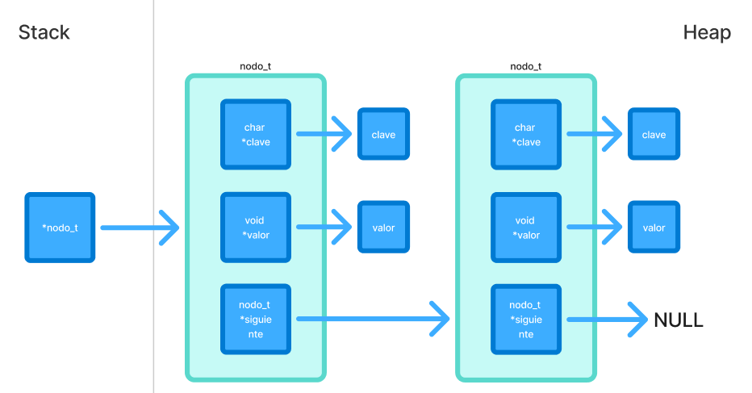
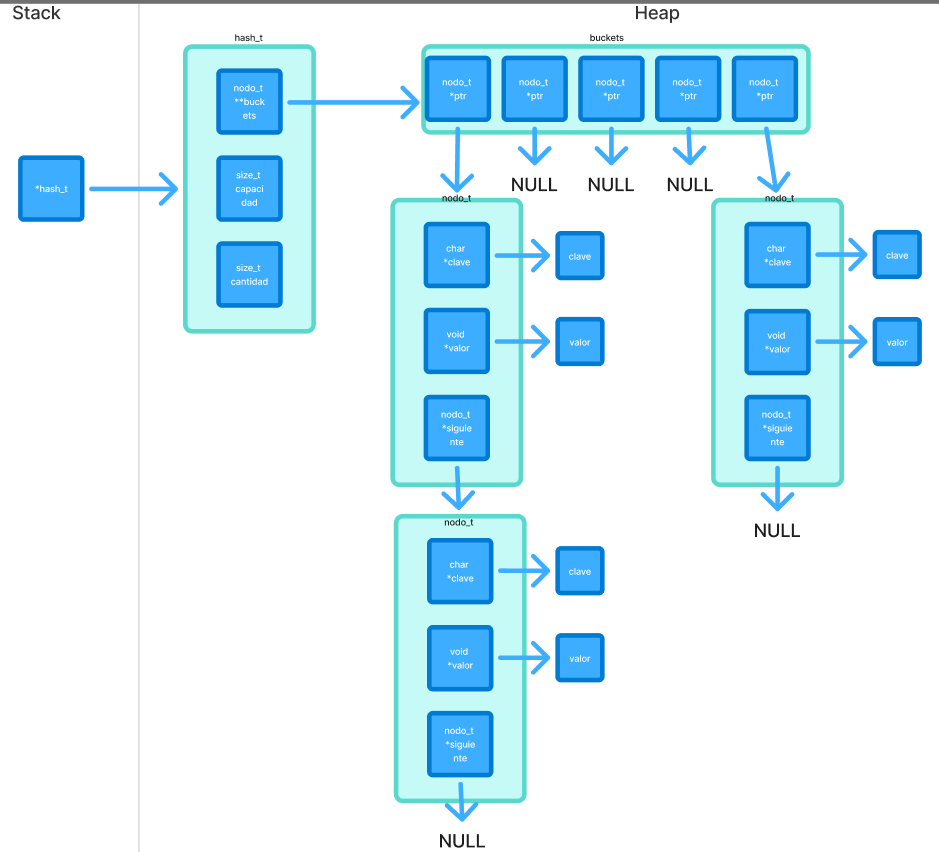

<div align="right">

</div>

# TDA HASH

## Repositorio de Luca Frisoni - 113497 - lfrisoni@fi.uba.ar / frisoniluca1@gmail.com(Github)

- Para compilar:

```bash
make compilar
```

- Para ejecutar:

```bash
./programa
```

- Para ejecutar con valgrind:

```bash
make valgrind
```

---

## 🛠️Funcionamiento

### 🏛️Estructuras

Para este trabajo práctico se definieron distintas estructuras de datos que permiten organizar y manipular los elementos de forma eficiente.  
A continuación se detallan las estructuras principales:

---

#### 🔹`nodo_t`

Representa un **nodo** enlazado.

- Contiene una clave char que permite el acceso al dato.
- Contiene un puntero genérico al dato almacenado.
- Guarda un puntero al siguiente nodo.

📊 **Diagrama de memoria:**  


---

#### 🔹`hash_t`

Representa la **tabla de hash**.

- Tiene un array de punteros que apuntan a **nodo_t**.
- Lleva un contador con la capacidad total de la tabla y la cantidad total de elementos.

📊 **Diagrama de memoria:**  


---

### ⚙️Funcionamiento General

---

### 1. Validación de parámetros

Antes de iniciar cualquier procesamiento, el programa valida que los parámetros de entrada sean correctos con `validando_params(argc, argv)`:

- 🔹 Cantidad de argumentos: deben ser **exactamente 5** (`<ejecutable> <archivo.csv> buscar nombre|id <valor>`).
- 🔹 Formato del archivo: se comprueba que el archivo pasado como `argv[1]` tenga la extensión **.csv** con `validando_formato_csv()`.
- 🔹 Comando de operación: el argumento `argv[2]` debe ser **'buscar'**.
- 🔹 Tipo de búsqueda: el argumento `argv[3]` debe ser **"nombre"** o **"id"**.

---

### 2.Flujo de Ejecución

---

### 2.1 Lectura principal (según `argv[1]`)

Se realiza la lectura de un archivo **.csv** cuya ubicacion fue pasado por parametro con `tp1_leer_archivo()`.

```c
tp1_t *tp1_leer_archivo(const char *nombre);
```

**📌¿Qué hace esta función?:**

- 🔹 Abre el archivo .csv indicado por parámetro
- 🔹 Lee cada línea del archivo y verifica que tenga el formato correcto.
- 🔹 Extrae la información de cada Pokémon contenido en el archivo.
- 🔹 Guarda todos los Pokémon válidos dentro de una estructura **tp1_t**.
- 🔹 Al finalizar, ordena los Pokémon por su id de manera ascendente.
- 🔹 Devuelve la estructura completa con todos los datos cargados.

- ⚠️ En caso de que el archivo no respete el formato, no se pueda abrir o falle la reserva de memoria, la función devuelve `NULL`.

---

### 2.2 Creacion de Hash

Se crea la estructura principial de este TDA con `hash_crear()` donde se almacenarán los Pokémon como pares clave → valor.

```c
hash_t *hash_crear(size_t capacidad_inicial);
```

---

### 2.3 Validacion de Funciones

Antes de continuar, se valida que ambas estructuras **(tp1_t y hash_t)** hayan sido creadas correctamente:

```c
bool validando_func(tp1_t *tp1, hash_t *hash);
```

⚠️ Si alguna falló, se liberan los recursos y finaliza el programa.

---

### 2.4 Cargando pokemones

Al pasar las validaciones, se insertan los pokemones en el Hash

```c
bool cargando_pokemons(tp1_t *tp1, hash_t *hash);
```

**📌¿Qué hace esta función?:**

- 🔹 Recorre cada Pokémon guardado en tp1 con su iterador interno.
- 🔹 Se llama a la función callback `guardar_en_hash()`, que inserta el Pokémon en el hash usando su nombre como clave.
- 🔹 Se valida que haya pokemones.

⚠️ Si la cantidad de elementos insertados no coincide con la cantidad total de pokemones, se liberan los recursos y finaliza el programa.

---

### 2.5 Buscando pokemon según operacion(según `argv[2]`)

El sistema permite al usuario hacer una busqueda entre 2 operaciones predefinidas.

#### 🔍 buscar

**Parámetros:** `<tipo_busqueda> <valor>`

- 🔹Segun el **tipo de busqueda**:

  - `nombre`: Busca directamente en el hash con `hash_buscar()` ya que el nombre es la clave.
  - `id`: Como el hash no tiene el id como clave, se itera con `hash_iterar()` e internamente se compara cada Pokémon con el id buscado mediante el callback `buscando_pk_id()`.

- 📌Si lo encuentra, se retorna el Pokémon.
- 📌Si no existe, devuelve **NULL**

---

### 2.6 Mostrando Pokemon

Si el Pokémon fue encontrado, se llama a:

```c
void mostrar_pokemon(struct pokemon *p);
```

📄 Se imprime:

- Id
- Nombre
- Tipo
- Ataque, Defensa, Velocidad

⚠️ Si no fue encontrado, se imprime un mensaje indicando lo mismo

---

### 3. Liberación de Memoria

Al finalizar la ejecución:

- 🗑️Se destruye la tabla de hash de Pokémones con `hash_destruir(hash)`.

- 🗑️Se libera la estructura principal del TP con `tp1_destruir(tp1)`.

Esto asegura que no queden memory leaks ni recursos sin liberar.

---

## Tests Unitarios

Esta sección describe cómo se verifican todas las funciones primitivas del proyecto mediante pruebas unitarias y de integracion.

### Objetivo

- 🔹Comprobar que cada función del proyecto se ejecute correctamente en distintos escenarios.
- 🔹Asegurar que las operaciones sobre las estructuras dinámicas se realicen sin errores de memoria.
- 🔹Validar el correcto funcionamiento de cada una de las Estructura de Datos.
- 🔹Confirmar que las funciones devuelvan los resultados esperados.
- 🔹Asegurarse el buen funcionamiento en casos demandantes

### Cobertura de pruebas

Se realizan 114 pruebas

Estos tests incluyen:

- 🔹**Pruebas de creacion**
- 🔹**Pruebas de incercion**
- 🔹**Pruebas de eliminacion**
- 🔹**Pruebas de busqueda**
- 🔹**Pruebas de liberacion de memoria**
- 🔹**Pruebas de iteracion**
- 🔹**Pruebas de combinacion de funciones**
- 🔹**Pruebas de estres**

### Compilación y ejecución de tests

Para compilar los tests:

```bash
make compilar_t
```

Para ejecutar los tests:

```bash
./tests
```

Para ejecutar con valgrind:

```bash
make valgrind_t
```

## 📈Complejidad computacional de las funciones primitivas

- **`hash_crear`** → O(1)
  La función hash_crear realiza un conjunto fijo de operaciones:
  Chequea valores constantes (como capacidad inicial).
  Reserva memoria para la estructura base del hash y sus buckets iniciales.
  No recorre estructuras ni depende del tamaño de la tabla, ya que recién se está iniciando.
  Por lo tanto, la complejidad es O(1) en todos los casos.

- **`hash_cantidad`** → O(1)
  Solo accede al campo cantidad de la estructura **hash_t**, lo que es una operación de acceso directo a memoria. No recorre ni calcula nada adicional.
  Por lo tanto, la complejidad es O(1) en todos los casos.

- **`hash_insertar`** → O(n) en el peor caso, O(k) amortizado promedio
  En el caso promedio, el algoritmo calcula el índice del bucket usando la función de hash en tiempo constante, y luego recorre como máximo los elementos del bucket para comprobar si la clave ya existe.
  Como el rehash mantiene el factor de carga bajo, la cantidad de elementos por bucket (k) tiende a ser muy baja y constante.
  Además, insertar al principio o después de un nodo es una operación O(1).Por lo tanto, en promedio:Inserción en O(k)

  En el peor de los casos, todas las claves pueden colisionar en el mismo bucket (por ejemplo, con hash mal diseñado o claves adversas). Entonces, la búsqueda dentro de ese bucket requiere recorrer hasta n elementos y la inserción también toma O(n).
  Además, si se dispara un rehash, se debe recorrer toda la tabla para reubicar cada nodo (también O(n)).

- **`hash_buscar`** → O()

- **`hash_contiene`** → O()

- **`hash_quitar`** → O()

- **`hash_iterar`** → O()

- **`hash_destruir`** → O()

- **`hash_destruir_todo`** → O()

## 📚 Respuestas a las preguntas teóricas(explicar con graficos)

### 1. Qué es un diccionario

### 2. Explicá 3 formas diferentes de implementar un diccionario.

### 3. Qué es una función de hash y qué características debe tener para nuestro problema en particular

### 4. Qué es una tabla de Hash y los diferentes métodos de resolución de colisiones vistos

### 5. Explique por qué es importante el tamaño de la tabla (tanto para tablas abiertas como cerradas)
